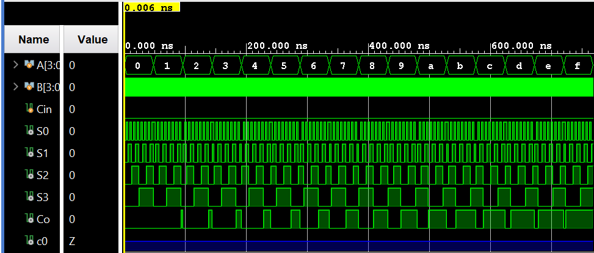

## 4-Bit Parallel Adder Using Full Adders

A Verilog implementation of a **4-bit ripple-carry (parallel) adder built from 1-bit full adders**, developed using the Vivado IDE. This document explains the underlying theory, revisits the 1-bit full adder design, shows how four full adders are cascaded to form a 4-bit parallel adder, and summarizes truth tables, K‑maps, and simulation results.

---

## Table of Contents

- [What Is a 4-Bit Parallel Adder?](#what-is-a-4-bit-parallel-adder)
- [Full Adder Refresher](#full-adder-refresher)
- [Learning Resources](#learning-resources)
- [Truth Tables](#truth-tables)
  - [Full Adder Truth Table](#full-adder-truth-table)
  - [4-Bit Adder Truth Table (Overview)](#4-bit-adder-truth-table-overview)
- [K-Maps and Boolean Derivations](#k-maps-and-boolean-derivations)
  - [Full Adder K-Maps](#full-adder-k-maps)
- [4-Bit Parallel Adder Architecture](#4-bit-parallel-adder-architecture)
- [Circuit Diagram](#circuit-diagram)
- [Waveform Diagram](#waveform-diagram)
- [Testbench Output](#testbench-output)
- [Running the Project in Vivado](#running-the-project-in-vivado)
- [Project Files](#project-files)

---

## What Is a 4-Bit Parallel Adder?

A **4-bit parallel adder** (also called a 4-bit ripple-carry adder) is a combinational circuit that adds two 4-bit binary numbers and an optional input carry to produce a 4-bit sum and a carry-out. The inputs and outputs are:

- **Inputs**
  - A<sub>3</sub> A<sub>2</sub> A<sub>1</sub> A<sub>0</sub> – first 4-bit operand.
  - B<sub>3</sub> B<sub>2</sub> B<sub>1</sub> B<sub>0</sub> – second 4-bit operand.
  - C<sub>i</sub> – input carry to the least significant bit (LSB) adder, often 0.
- **Outputs**
  - S<sub>3</sub> S<sub>2</sub> S<sub>1</sub> S<sub>0</sub> – sum bits representing (A + B + C<sub>i</sub>) mod 16.
  - C<sub>o</sub> – final carry-out, which is 1 when the true sum exceeds 4 bits.

In this project, the 4-bit adder is implemented **structurally** by cascading **four 1-bit full adder modules**. This mirrors how multi-bit additions are performed by hand: we add bit-by-bit from LSB to MSB, propagating the carry into the next position.

---

## Full Adder Refresher

A **1-bit full adder** adds three single-bit inputs and produces a **sum** S and a **carry-out** C<sub>o</sub>.

- **Inputs:** A, B, C<sub>i</sub>
- **Outputs:** S, C<sub>o</sub>

The standard Boolean equations for a full adder are:

- S = A ⊕ B ⊕ C<sub>i</sub>
- C<sub>o</sub> = A·B + A·C<sub>i</sub> + B·C<sub>i</sub>

In this project, the module `fullAdder` realizes these equations and is then reused as the building block of the 4-bit parallel adder.

---

## Learning Resources

Useful online resources for full adders, ripple-carry adders, and digital design:

| Resource | Description |
|----------|-------------|
| [Full Adder (YouTube)](https://www.youtube.com/results?search_query=full+adder) | Concept, truth table, and typical gate‑level implementations. |
| [K-Map Simplification (YouTube)](https://www.youtube.com/results?search_query=karnaugh+map+simplification) | Karnaugh‑map based derivation of minimal sum and carry expressions. |
| [Ripple Carry / Parallel Adders (YouTube)](https://www.youtube.com/results?search_query=ripple+carry+adder+4+bit) | How multiple full adders are cascaded to build multi‑bit adders. |
| [Verilog Full Adder & Testbench (YouTube)](https://www.youtube.com/results?search_query=full+adder+verilog+testbench) | RTL and testbench examples in Verilog. |

---

## Truth Tables

### Full Adder Truth Table

The 1-bit full adder has three inputs A, B, C<sub>i</sub> and two outputs S, C<sub>o</sub>. Its truth table is:

| **A** | **B** | **C<sub>i</sub>** | **‖** | **S** | **C<sub>o</sub>** |
|:-----:|:-----:|:--------:|:-----:|:-----:|:--------:|
| **———** | **———** | **———** | **———** | **———** | **———** |
| 0 | 0 | 0 | **\|** | 0 | 0 |
| 0 | 0 | 1 | **\|** | 1 | 0 |
| 0 | 1 | 0 | **\|** | 1 | 0 |
| 0 | 1 | 1 | **\|** | 0 | 1 |
| 1 | 0 | 0 | **\|** | 1 | 0 |
| 1 | 0 | 1 | **\|** | 0 | 1 |
| 1 | 1 | 0 | **\|** | 0 | 1 |
| 1 | 1 | 1 | **\|** | 1 | 1 |

This is the **final truth table** of the 1-bit full adder. It remains unchanged whether the full adder is realized directly from logic equations or used inside a larger multi‑bit adder.

### 4-Bit Adder Truth Table (Overview)

The 4-bit parallel adder adds:

(A<sub>3</sub> A<sub>2</sub> A<sub>1</sub> A<sub>0</sub>)₂ + (B<sub>3</sub> B<sub>2</sub> B<sub>1</sub> B<sub>0</sub>)₂ + C<sub>i</sub> → (C<sub>o</sub> S<sub>3</sub> S<sub>2</sub> S<sub>1</sub> S<sub>0</sub>)₂

There are 2⁴ × 2⁴ = 256 possible (A, B) input combinations (and 512 if we also vary C<sub>i</sub>). Listing all of them results in a very long table, so only a representative subset is shown here:

| **A**   | **B**   | **S**   | **C<sub>o</sub>** |
|:-------:|:-------:|:-------:|:--------:|
| 0000 | 0000 | 0000 | 0 |
| 0000 | 0001 | 0001 | 0 |
| 0000 | 1111 | 1111 | 0 |
| 0001 | 0001 | 0010 | 0 |
| 0010 | 1111 | 0001 | 1 |
| 0111 | 0001 | 1000 | 0 |
| 1111 | 0001 | 0000 | 1 |
| 1111 | 1111 | 1110 | 1 |

The rule is straightforward: S is the lower 4 bits of the binary sum, and C<sub>o</sub> is the overflow bit when the exact sum is ≥ 16. The **Simulation Output** section later includes the complete enumerated results used in the testbench.

---

## K-Maps and Boolean Derivations

### Full Adder K-Maps

For the full adder, we use A as the row variable and B C<sub>i</sub> as the column variables in Gray code order 00, 01, 11, 10.

**Sum S:**

| **A \\ B C<sub>i</sub>** | **00** | **01** | **11** | **10** |
|:---------------:|:------:|:------:|:------:|:------:|
| **0** | 0 | 1 | 0 | 1 |
| **1** | 1 | 0 | 1 | 0 |

From the K-map, S is 1 whenever an **odd number** of A, B, C<sub>i</sub> are 1. Grouping and simplifying yields:

- S = A·B′·C<sub>i</sub>′ + A′·B′·C<sub>i</sub> + A·B·C<sub>i</sub> + A′·B·C<sub>i</sub>′
- S = A·(B ⊙ C<sub>i</sub>) + A′·(B ⊕ C<sub>i</sub>)

Let X = B ⊕ C<sub>i</sub> (so X′ = B ⊙ C<sub>i</sub>). Then:

- S = A·X′ + A′·X = A ⊕ X = A ⊕ B ⊕ C<sub>i</sub>

**Carry-out C<sub>o</sub>:**

| **A \\ B C<sub>i</sub>** | **00** | **01** | **11** | **10** |
|:---------------:|:------:|:------:|:------:|:------:|
| **0** | 0 | 0 | 1 | 0 |
| **1** | 0 | 1 | 1 | 1 |

Grouping the 1s in pairs gives:

- C<sub>o</sub> = A·C<sub>i</sub> + B·C<sub>i</sub> + A·B

These minimized equations are exactly what the `fullAdder` module implements, and they are reused four times in the 4-bit parallel adder.

---

## 4-Bit Parallel Adder Architecture

To build the 4-bit parallel adder, we **cascade four 1-bit full adders** so that the carry-out of each stage becomes the carry-in of the next stage:

1. **Least Significant Bit (LSB) Stage**
   - Inputs: A<sub>0</sub>, B<sub>0</sub>, global C<sub>i</sub> (often 0).
   - Outputs: S<sub>0</sub>, intermediate carry C<sub>1</sub>.
2. **Bit 1 Stage**
   - Inputs: A<sub>1</sub>, B<sub>1</sub>, carry C<sub>1</sub>.
   - Outputs: S<sub>1</sub>, intermediate carry C<sub>2</sub>.
3. **Bit 2 Stage**
   - Inputs: A<sub>2</sub>, B<sub>2</sub>, carry C<sub>2</sub>.
   - Outputs: S<sub>2</sub>, intermediate carry C<sub>3</sub>.
4. **Most Significant Bit (MSB) Stage**
   - Inputs: A<sub>3</sub>, B<sub>3</sub>, carry C<sub>3</sub>.
   - Outputs: S<sub>3</sub>, final carry-out C<sub>o</sub>.

In Verilog, this is realized in the `fourBitAdder` module, which instantiates the `fullAdder` module four times and connects the internal carry wires between them. The carry “ripples” from the LSB to the MSB, hence the name **ripple-carry adder**.

---

## Circuit Diagram

This section corresponds to the **block diagram** of the 4-bit parallel adder, showing four full adders connected in series with carries rippling from LSB to MSB.

> **Image placeholder:** This is where you should insert the **circuit diagram image for the 4-bit parallel adder** (e.g., a block diagram with four full-adder blocks and internal carry connections).

---

## Waveform Diagram

The behavioral simulation waveform shows inputs A, B (and optionally C<sub>i</sub>) cycling through all combinations, while outputs S and C<sub>o</sub> follow the expected 4-bit addition results.



---

## Testbench Output

The testbench exhaustively applies all combinations of 4-bit inputs \(A\) and \(B\) (and appropriate carries) and prints the resulting sum and carry-out. The following log shows the **complete simulation output** used to verify correctness.

To keep the README readable, the full output is placed inside a scrollable block:

<details>
<summary><strong>Click to expand full 4-bit adder simulation log</strong></summary>

```text
A = 0000, B = 0000, S = 0000, Co = 0
A = 0000, B = 0001, S = 0001, Co = 0
A = 0000, B = 0010, S = 0010, Co = 0
A = 0000, B = 0011, S = 0011, Co = 0
A = 0000, B = 0100, S = 0100, Co = 0
A = 0000, B = 0101, S = 0101, Co = 0
A = 0000, B = 0110, S = 0110, Co = 0
A = 0000, B = 0111, S = 0111, Co = 0
A = 0000, B = 1000, S = 1000, Co = 0
A = 0000, B = 1001, S = 1001, Co = 0
A = 0000, B = 1010, S = 1010, Co = 0
A = 0000, B = 1011, S = 1011, Co = 0
A = 0000, B = 1100, S = 1100, Co = 0
A = 0000, B = 1101, S = 1101, Co = 0
A = 0000, B = 1110, S = 1110, Co = 0
A = 0000, B = 1111, S = 1111, Co = 0
A = 0001, B = 0000, S = 0001, Co = 0
A = 0001, B = 0001, S = 0010, Co = 0
A = 0001, B = 0010, S = 0011, Co = 0
A = 0001, B = 0011, S = 0100, Co = 0
A = 0001, B = 0100, S = 0101, Co = 0
A = 0001, B = 0101, S = 0110, Co = 0
A = 0001, B = 0110, S = 0111, Co = 0
A = 0001, B = 0111, S = 1000, Co = 0
A = 0001, B = 1000, S = 1001, Co = 0
A = 0001, B = 1001, S = 1010, Co = 0
A = 0001, B = 1010, S = 1011, Co = 0
A = 0001, B = 1011, S = 1100, Co = 0
A = 0001, B = 1100, S = 1101, Co = 0
A = 0001, B = 1101, S = 1110, Co = 0
A = 0001, B = 1110, S = 1111, Co = 0
A = 0001, B = 1111, S = 0000, Co = 1
A = 0010, B = 0000, S = 0010, Co = 0
A = 0010, B = 0001, S = 0011, Co = 0
A = 0010, B = 0010, S = 0100, Co = 0
A = 0010, B = 0011, S = 0101, Co = 0
A = 0010, B = 0100, S = 0110, Co = 0
A = 0010, B = 0101, S = 0111, Co = 0
A = 0010, B = 0110, S = 1000, Co = 0
A = 0010, B = 0111, S = 1001, Co = 0
A = 0010, B = 1000, S = 1010, Co = 0
A = 0010, B = 1001, S = 1011, Co = 0
A = 0010, B = 1010, S = 1100, Co = 0
A = 0010, B = 1011, S = 1101, Co = 0
A = 0010, B = 1100, S = 1110, Co = 0
A = 0010, B = 1101, S = 1111, Co = 0
A = 0010, B = 1110, S = 0000, Co = 1
A = 0010, B = 1111, S = 0001, Co = 1
A = 0011, B = 0000, S = 0011, Co = 0
A = 0011, B = 0001, S = 0100, Co = 0
A = 0011, B = 0010, S = 0101, Co = 0
A = 0011, B = 0011, S = 0110, Co = 0
A = 0011, B = 0100, S = 0111, Co = 0
A = 0011, B = 0101, S = 1000, Co = 0
A = 0011, B = 0110, S = 1001, Co = 0
A = 0011, B = 0111, S = 1010, Co = 0
A = 0011, B = 1000, S = 1011, Co = 0
A = 0011, B = 1001, S = 1100, Co = 0
A = 0011, B = 1010, S = 1101, Co = 0
A = 0011, B = 1011, S = 1110, Co = 0
A = 0011, B = 1100, S = 1111, Co = 0
A = 0011, B = 1101, S = 0000, Co = 1
A = 0011, B = 1110, S = 0001, Co = 1
A = 0011, B = 1111, S = 0010, Co = 1
A = 0100, B = 0000, S = 0100, Co = 0
A = 0100, B = 0001, S = 0101, Co = 0
A = 0100, B = 0010, S = 0110, Co = 0
A = 0100, B = 0011, S = 0111, Co = 0
A = 0100, B = 0100, S = 1000, Co = 0
A = 0100, B = 0101, S = 1001, Co = 0
A = 0100, B = 0110, S = 1010, Co = 0
A = 0100, B = 0111, S = 1011, Co = 0
A = 0100, B = 1000, S = 1100, Co = 0
A = 0100, B = 1001, S = 1101, Co = 0
A = 0100, B = 1010, S = 1110, Co = 0
A = 0100, B = 1011, S = 1111, Co = 0
A = 0100, B = 1100, S = 0000, Co = 1
A = 0100, B = 1101, S = 0001, Co = 1
A = 0100, B = 1110, S = 0010, Co = 1
A = 0100, B = 1111, S = 0011, Co = 1
A = 0101, B = 0000, S = 0101, Co = 0
A = 0101, B = 0001, S = 0110, Co = 0
A = 0101, B = 0010, S = 0111, Co = 0
A = 0101, B = 0011, S = 1000, Co = 0
A = 0101, B = 0100, S = 1001, Co = 0
A = 0101, B = 0101, S = 1010, Co = 0
A = 0101, B = 0110, S = 1011, Co = 0
A = 0101, B = 0111, S = 1100, Co = 0
A = 0101, B = 1000, S = 1101, Co = 0
A = 0101, B = 1001, S = 1110, Co = 0
A = 0101, B = 1010, S = 1111, Co = 0
A = 0101, B = 1011, S = 0000, Co = 1
A = 0101, B = 1100, S = 0001, Co = 1
A = 0101, B = 1101, S = 0010, Co = 1
A = 0101, B = 1110, S = 0011, Co = 1
A = 0101, B = 1111, S = 0100, Co = 1
A = 0110, B = 0000, S = 0110, Co = 0
A = 0110, B = 0001, S = 0111, Co = 0
A = 0110, B = 0010, S = 1000, Co = 0
A = 0110, B = 0011, S = 1001, Co = 0
A = 0110, B = 0100, S = 1010, Co = 0
A = 0110, B = 0101, S = 1011, Co = 0
A = 0110, B = 0110, S = 1100, Co = 0
A = 0110, B = 0111, S = 1101, Co = 0
A = 0110, B = 1000, S = 1110, Co = 0
A = 0110, B = 1001, S = 1111, Co = 0
A = 0110, B = 1010, S = 0000, Co = 1
A = 0110, B = 1011, S = 0001, Co = 1
A = 0110, B = 1100, S = 0010, Co = 1
A = 0110, B = 1101, S = 0011, Co = 1
A = 0110, B = 1110, S = 0100, Co = 1
A = 0110, B = 1111, S = 0101, Co = 1
A = 0111, B = 0000, S = 0111, Co = 0
A = 0111, B = 0001, S = 1000, Co = 0
A = 0111, B = 0010, S = 1001, Co = 0
A = 0111, B = 0011, S = 1010, Co = 0
A = 0111, B = 0100, S = 1011, Co = 0
A = 0111, B = 0101, S = 1100, Co = 0
A = 0111, B = 0110, S = 1101, Co = 0
A = 0111, B = 0111, S = 1110, Co = 0
A = 0111, B = 1000, S = 1111, Co = 0
A = 0111, B = 1001, S = 0000, Co = 1
A = 0111, B = 1010, S = 0001, Co = 1
A = 0111, B = 1011, S = 0010, Co = 1
A = 0111, B = 1100, S = 0011, Co = 1
A = 0111, B = 1101, S = 0100, Co = 1
A = 0111, B = 1110, S = 0101, Co = 1
A = 0111, B = 1111, S = 0110, Co = 1
A = 1000, B = 0000, S = 1000, Co = 0
A = 1000, B = 0001, S = 1001, Co = 0
A = 1000, B = 0010, S = 1010, Co = 0
A = 1000, B = 0011, S = 1011, Co = 0
A = 1000, B = 0100, S = 1100, Co = 0
A = 1000, B = 0101, S = 1101, Co = 0
A = 1000, B = 0110, S = 1110, Co = 0
A = 1000, B = 0111, S = 1111, Co = 0
A = 1000, B = 1000, S = 0000, Co = 1
A = 1000, B = 1001, S = 0001, Co = 1
A = 1000, B = 1010, S = 0010, Co = 1
A = 1000, B = 1011, S = 0011, Co = 1
A = 1000, B = 1100, S = 0100, Co = 1
A = 1000, B = 1101, S = 0101, Co = 1
A = 1000, B = 1110, S = 0110, Co = 1
A = 1000, B = 1111, S = 0111, Co = 1
A = 1001, B = 0000, S = 1001, Co = 0
A = 1001, B = 0001, S = 1010, Co = 0
A = 1001, B = 0010, S = 1011, Co = 0
A = 1001, B = 0011, S = 1100, Co = 0
A = 1001, B = 0100, S = 1101, Co = 0
A = 1001, B = 0101, S = 1110, Co = 0
A = 1001, B = 0110, S = 1111, Co = 0
A = 1001, B = 0111, S = 0000, Co = 1
A = 1001, B = 1000, S = 0001, Co = 1
A = 1001, B = 1001, S = 0010, Co = 1
A = 1001, B = 1010, S = 0011, Co = 1
A = 1001, B = 1011, S = 0100, Co = 1
A = 1001, B = 1100, S = 0101, Co = 1
A = 1001, B = 1101, S = 0110, Co = 1
A = 1001, B = 1110, S = 0111, Co = 1
A = 1001, B = 1111, S = 1000, Co = 1
A = 1010, B = 0000, S = 1010, Co = 0
A = 1010, B = 0001, S = 1011, Co = 0
A = 1010, B = 0010, S = 1100, Co = 0
A = 1010, B = 0011, S = 1101, Co = 0
A = 1010, B = 0100, S = 1110, Co = 0
A = 1010, B = 0101, S = 1111, Co = 0
A = 1010, B = 0110, S = 0000, Co = 1
A = 1010, B = 0111, S = 0001, Co = 1
A = 1010, B = 1000, S = 0010, Co = 1
A = 1010, B = 1001, S = 0011, Co = 1
A = 1010, B = 1010, S = 0100, Co = 1
A = 1010, B = 1011, S = 0101, Co = 1
A = 1010, B = 1100, S = 0110, Co = 1
A = 1010, B = 1101, S = 0111, Co = 1
A = 1010, B = 1110, S = 1000, Co = 1
A = 1010, B = 1111, S = 1001, Co = 1
A = 1011, B = 0000, S = 1011, Co = 0
A = 1011, B = 0001, S = 1100, Co = 0
A = 1011, B = 0010, S = 1101, Co = 0
A = 1011, B = 0011, S = 1110, Co = 0
A = 1011, B = 0100, S = 1111, Co = 0
A = 1011, B = 0101, S = 0000, Co = 1
A = 1011, B = 0110, S = 0001, Co = 1
A = 1011, B = 0111, S = 0010, Co = 1
A = 1011, B = 1000, S = 0011, Co = 1
A = 1011, B = 1001, S = 0100, Co = 1
A = 1011, B = 1010, S = 0101, Co = 1
A = 1011, B = 1011, S = 0110, Co = 1
A = 1011, B = 1100, S = 0111, Co = 1
A = 1011, B = 1101, S = 1000, Co = 1
A = 1011, B = 1110, S = 1001, Co = 1
A = 1011, B = 1111, S = 1010, Co = 1
A = 1100, B = 0000, S = 1100, Co = 0
A = 1100, B = 0001, S = 1101, Co = 0
A = 1100, B = 0010, S = 1110, Co = 0
A = 1100, B = 0011, S = 1111, Co = 0
A = 1100, B = 0100, S = 0000, Co = 1
A = 1100, B = 0101, S = 0001, Co = 1
A = 1100, B = 0110, S = 0010, Co = 1
A = 1100, B = 0111, S = 0011, Co = 1
A = 1100, B = 1000, S = 0100, Co = 1
A = 1100, B = 1001, S = 0101, Co = 1
A = 1100, B = 1010, S = 0110, Co = 1
A = 1100, B = 1011, S = 0111, Co = 1
A = 1100, B = 1100, S = 1000, Co = 1
A = 1100, B = 1101, S = 1001, Co = 1
A = 1100, B = 1110, S = 1010, Co = 1
A = 1100, B = 1111, S = 1011, Co = 1
A = 1101, B = 0000, S = 1101, Co = 0
A = 1101, B = 0001, S = 1110, Co = 0
A = 1101, B = 0010, S = 1111, Co = 0
A = 1101, B = 0011, S = 0000, Co = 1
A = 1101, B = 0100, S = 0001, Co = 1
A = 1101, B = 0101, S = 0010, Co = 1
A = 1101, B = 0110, S = 0011, Co = 1
A = 1101, B = 0111, S = 0100, Co = 1
A = 1101, B = 1000, S = 0101, Co = 1
A = 1101, B = 1001, S = 0110, Co = 1
A = 1101, B = 1010, S = 0111, Co = 1
A = 1101, B = 1011, S = 1000, Co = 1
A = 1101, B = 1100, S = 1001, Co = 1
A = 1101, B = 1101, S = 1010, Co = 1
A = 1101, B = 1110, S = 1011, Co = 1
A = 1101, B = 1111, S = 1100, Co = 1
A = 1110, B = 0000, S = 1110, Co = 0
A = 1110, B = 0001, S = 1111, Co = 0
A = 1110, B = 0010, S = 0000, Co = 1
A = 1110, B = 0011, S = 0001, Co = 1
A = 1110, B = 0100, S = 0010, Co = 1
A = 1110, B = 0101, S = 0011, Co = 1
A = 1110, B = 0110, S = 0100, Co = 1
A = 1110, B = 0111, S = 0101, Co = 1
A = 1110, B = 1000, S = 0110, Co = 1
A = 1110, B = 1001, S = 0111, Co = 1
A = 1110, B = 1010, S = 1000, Co = 1
A = 1110, B = 1011, S = 1001, Co = 1
A = 1110, B = 1100, S = 1010, Co = 1
A = 1110, B = 1101, S = 1011, Co = 1
A = 1110, B = 1110, S = 1100, Co = 1
A = 1110, B = 1111, S = 1101, Co = 1
A = 1111, B = 0000, S = 1111, Co = 0
A = 1111, B = 0001, S = 0000, Co = 1
A = 1111, B = 0010, S = 0001, Co = 1
A = 1111, B = 0011, S = 0010, Co = 1
A = 1111, B = 0100, S = 0011, Co = 1
A = 1111, B = 0101, S = 0100, Co = 1
A = 1111, B = 0110, S = 0101, Co = 1
A = 1111, B = 0111, S = 0110, Co = 1
A = 1111, B = 1000, S = 0111, Co = 1
A = 1111, B = 1001, S = 1000, Co = 1
A = 1111, B = 1010, S = 1001, Co = 1
A = 1111, B = 1011, S = 1010, Co = 1
A = 1111, B = 1100, S = 1011, Co = 1
A = 1111, B = 1101, S = 1100, Co = 1
A = 1111, B = 1110, S = 1101, Co = 1
A = 1111, B = 1111, S = 1110, Co = 1
```

</details>

These results match the theoretical 4-bit addition results for all combinations, confirming that the **4-bit parallel adder built from full adders** is functionally correct.

---

## Running the Project in Vivado

Follow these steps to open the project in **Vivado** and run the simulation.

### Prerequisites

- **Xilinx Vivado** installed (Vivado HL Design Edition, Lab Edition, or any recent version compatible with your OS).

### 1. Launch Vivado

1. Start Vivado from the Start Menu (Windows) or your application launcher.
2. Choose **Vivado** (or **Vivado HLx**).

### 2. Create a New RTL Project

1. Click **Create Project** (or **File → Project → New**).
2. Click **Next** on the welcome page.
3. Choose **RTL Project** and leave **Do not specify sources at this time** unchecked if you plan to add sources immediately.
4. Click **Next**.

### 3. Add Design and Simulation Sources

1. In the **Add Sources** step, add the Verilog design files:
   - **Design sources:**
     - `fullAdder.v` – 1-bit full adder module.
     - `fourBitAdder.v` – 4-bit parallel adder constructed from four `fullAdder` instances.
   - **Simulation sources:**
     - `fourBitAdder_tb.v` – testbench applying all input combinations and printing the outputs.
2. Ensure the testbench is set as the **top module for simulation**:
   - In the **Sources** window, under **Simulation Sources**, right‑click `fourBitAdder_tb.v` → **Set as Top**.
3. Click **Next**, choose a suitable **target device** (or leave default/“Don’t specify” for simulation‑only usage), then **Next → Finish**.

### 4. Run Behavioral Simulation

1. In the **Flow Navigator** (left panel), under **Simulation**, click **Run Behavioral Simulation**.
2. Vivado will:
   - Elaborate the design hierarchy (`fourBitAdder` instantiating `fullAdder`).
   - Compile the design and testbench.
   - Open the **Simulation** view with the waveform.
3. Inspect the waveform:
   - Confirm that A and B cycle through all combinations.
   - Verify that S and C<sub>o</sub> match the 4-bit addition rule: C<sub>o</sub>·2⁴ + S = A + B + C<sub>i</sub>.

### 5. (Optional) Re-run or Modify the Design

- To re-run the simulation, use **Flow Navigator → Simulation → Run Behavioral Simulation** or the re-run icon in the simulation toolbar.
- To change the design or testbench:
  - Edit `fullAdder.v`, `fourBitAdder.v`, or `fourBitAdder_tb.v`.
  - Save the files.
  - Re-run the behavioral simulation.

### 6. (Optional) Synthesis, Implementation, and Bitstream

If you want to map the design to a physical FPGA:

1. In **Sources**, right‑click the top-level RTL module (e.g., `fourBitAdder.v`) → **Set as Top** (for synthesis/implementation).
2. Run **Synthesis** from the Flow Navigator.
3. Run **Implementation**.
4. Create or edit a constraints file (e.g. `.xdc`) to assign pins for A<sub>3</sub>..A<sub>0</sub>, B<sub>3</sub>..B<sub>0</sub>, S<sub>3</sub>..S<sub>0</sub>, and C<sub>o</sub> (and C<sub>i</sub> if used).
5. Run **Generate Bitstream** to produce the configuration file for your FPGA board.

---

## Project Files

- `fullAdder.v` — RTL for the 1-bit full adder (A, B, C<sub>i</sub>) → (S, C<sub>o</sub>).
- `fourBitAdder.v` — RTL for the 4-bit parallel adder constructed from four full adders (A[3:0], B[3:0], C<sub>i</sub>) → (S[3:0], C<sub>o</sub>).
- `fourBitAdder_tb.v` — Testbench for the 4-bit parallel adder; applies all input combinations and prints/observes the outputs.

*Author: **Kadhir Ponnambalam***

